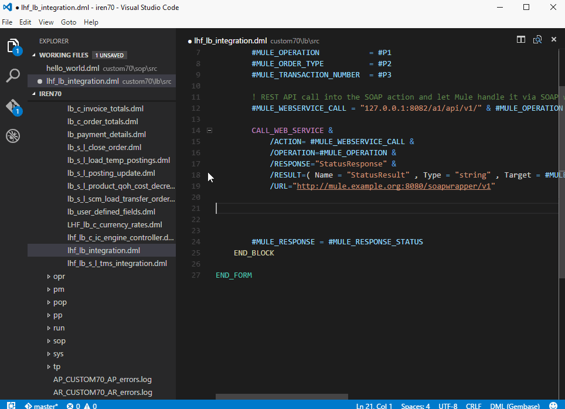

# Gembase DML Editor Extension for Visual Studio Code

This extension provides Syntax highlighting and Snippets for Gembase DML (Data Manipulation Language).

To install download the copy the folder vscode-gembase-dml and place it in your .vscode\extensions folder (on Windows this is: C:\Users\yourusername\.vscode\extensions\)

